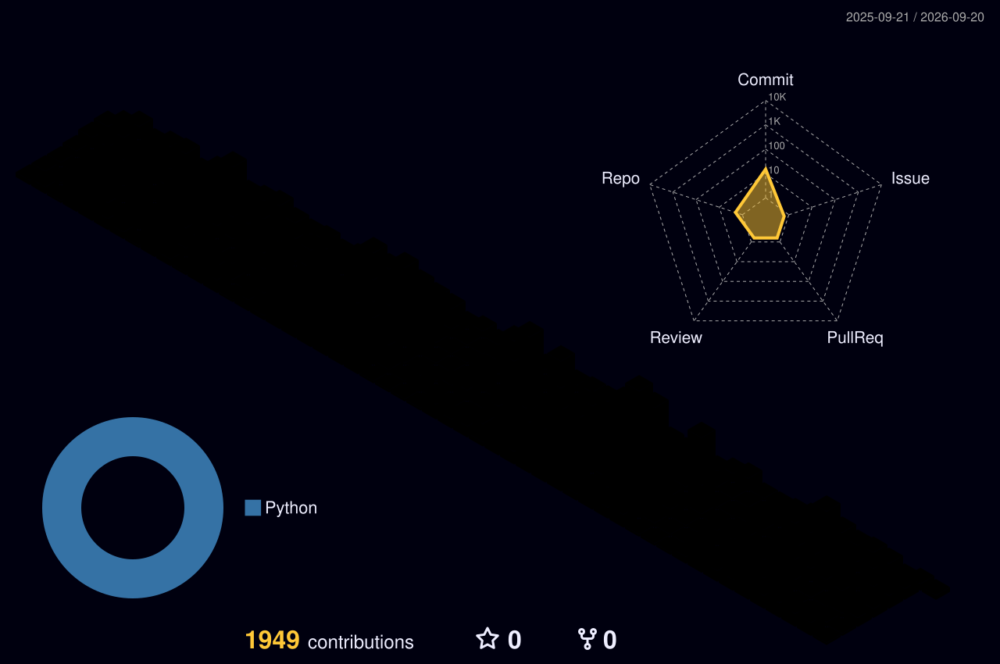

<!-- ======================================================== -->
<!-- 🌟 HEADER SECTION: Dynamic Animated Wave & Title Banner   -->
<!-- ======================================================== -->
<p align="center">
  
</p>

<!-- Dynamic Multi-Line Typing Animation -->
<p align="center">
  <a href="https://github.com/esmaail-lateq">
    
  </a>
</p>

<!-- Animated Engineering Badges & Status Strip -->
<p align="center">
  <a href="https://play.google.com/store/apps/developer?id=JUSAIM+DEV" target="_blank">
    
  </a>
  
  
  
</p>

<!-- Live Profile Counter & Status -->
<p align="center">
  <a href="https://github.com/esmaail-lateq">
    
  </a>
  <a href="https://play.google.com/store/apps/developer?id=JUSAIM+DEV" target="_blank">
    
  </a>
  
  
</p>

<!-- Dynamic Animated GitHub Profile Trophies -->
<p align="center">
  <a href="https://github.com/ryo-ma/github-profile-trophy">
    
  </a>
</p>

---

<!-- ======================================================== -->
<!-- 🌐 CONNECT & SOCIAL HUB                                 -->
<!-- ======================================================== -->
<p align="center">
  
</p>

<p align="center">
  <a href="https://linkedin.com/in/esmail-almaweri" target="_blank">
    
  </a>
  <a href="https://play.google.com/store/apps/developer?id=JUSAIM+DEV" target="_blank">
    
  </a>
  <a href="https://www.behance.net/esmaailalmawri" target="_blank">
    
  </a>
  <a href="https://instagram.com/esmaail.mohammed" target="_blank">
    
  </a>
  <a href="mailto:esmaail.m.almaweri@gmail.com" target="_blank">
    
  </a>
</p>

---

<!-- ======================================================== -->
<!-- 🖥️ TERMINAL SYSTEM & EXECUTIVE ENGINEERING SPEC          -->
<!-- ======================================================== -->
<p align="center">
  
</p>

<table align="center" width="100%">
  <tr>
    <td width="30%" align="center" valign="middle">
      <br/>
      
    </td>
    <td width="70%" valign="top">

```bash
esmail@workstation ~ % neofetch
──────────────────────────────────────────────────────────
OS            : macOS / Linux Enterprise (x86_64 / arm64)
ENGINEER      : Esmail Al-Maweri (JUSAIM DEV)
SPECIALTY     : Flutter Mobile Architect & Laravel Backend Specialist
COMPLIANCE    : Android 15 (16KB Page Size Aligned) & Google Play Policies
STANDARDS     : Clean Architecture, SOLID, DDD, Hardware-Bound Security
FLAGSHIPS     : 6+ Production Apps Live on Google Play Store
POS PROTOCOL  : Strict Device-ID Hardware Shift-Locking System
STATUS        : 🟢 System Operational • 100% Uptime
──────────────────────────────────────────────────────────
```

    </td>
  </tr>
</table>

* 🚀 **Full-Stack & Mobile Craftsmanship:** Specializing in building enterprise-grade mobile applications with **Flutter & Dart**, backed by resilient, scalable backends powered by **Laravel, Redis, and Microservices**.
* 📐 **CAD & Spatial Math Engines:** Engineered dynamic 2D architectural floor plan generators and spatial calculators with automated PDF engineering report generation.
* 🛡️ **Proprietary POS Security Architecture:** Designed and implemented the **Strict Device-ID Shift-Locking Protocol** preventing overlapping cashier shifts across POS hardware terminals.
* 📱 **Modern Android SDK Standard:** Strict alignment with **16KB memory page sizes** and low-latency native runtime performance.
* 💡 **Engineering Motto:** *"Clean code is not just an aesthetic choice; it is an architectural commitment to reliability, performance, and scalability."*

---

<!-- ======================================================== -->
<!-- 🛠️ TECH STACK & ARSENAL MATRIX                          -->
<!-- ======================================================== -->
<p align="center">
  
</p>

<div align="center">

#### 📱 Mobile, CAD & Cross-Platform
<a href="https://skillicons.dev">
  
</a>

#### ⚙️ Backend, Frameworks & APIs
<a href="https://skillicons.dev">
  
</a>

#### 🗄️ Databases, Cloud & DevOps
<a href="https://skillicons.dev">
  
</a>

#### 🎨 Design & Engineering Tools
<a href="https://skillicons.dev">
  
</a>

</div>

---

<!-- ======================================================== -->
<!-- 🚀 FEATURED PRODUCTION APPS & FLAGSHIP ARCHITECTURES     -->
<!-- ======================================================== -->
<p align="center">
  
</p>

<p align="center">
  <i>A curated selection of commercial and enterprise applications engineered and published live on the Google Play Store.</i>
</p>

<table>
  <!-- ROW 1: Hospitality Ecosystem -->
  <tr>
    <td width="50%" valign="top">
      <h4 align="center">🏨 الفندق اليمني (Yemeni Hotel — Guests)</h4>
      <p align="center">
        <a href="https://play.google.com/store/apps/details?id=com.hotelguests.app.hotelguests" target="_blank">
          
        </a>
        
      </p>
      <p><b>Overview:</b> Comprehensive hospitality guest booking platform. Enables interactive room exploration, real-time booking pipelines, geolocation hotel mapping, and streamlined check-in workflows.</p>
      <p><b>Tech Stack:</b> <code>Flutter</code> • <code>Laravel API</code> • <code>Google Maps SDK</code> • <code>Sanctum Auth</code></p>
    </td>
    <td width="50%" valign="top">
      <h4 align="center">🏢 الفندق اليمني لملاك الفنادق (Owners Suite)</h4>
      <p align="center">
        <a href="https://play.google.com/store/apps/details?id=com.yemenihotel.owner" target="_blank">
          
        </a>
        
      </p>
      <p><b>Overview:</b> Enterprise hotel operations management suite. Features complex room reservation matrices, occupancy rate calculations, dynamic pricing tiers, and financial reporting dashboards.</p>
      <p><b>Tech Stack:</b> <code>Flutter</code> • <code>Laravel Backend</code> • <code>Redis Caching</code> • <code>FCM Notifications</code></p>
    </td>
  </tr>

  <!-- ROW 2: Engineering/Inspection & SaaS POS -->
  <tr>
    <td width="50%" valign="top">
      <h4 align="center">📐 فحص مباني ومخططات معمارية (Building Inspection)</h4>
      <p align="center">
        <a href="https://play.google.com/store/apps/details?id=com.bi.ersei" target="_blank">
          
        </a>
        
      </p>
      <p><b>Overview:</b> Advanced civil & architectural inspection app. Features dynamic 2D floor plan generation, structural area computation, field inspection workflows, and automated PDF engineering report synthesis.</p>
      <p><b>Tech Stack:</b> <code>Flutter</code> • <code>Custom 2D Canvas</code> • <code>PDF Generator</code> • <code>SQLite Engine</code></p>
    </td>
    <td width="50%" valign="top">
      <h4 align="center">💳 My Point | نقاطي (SaaS & Loyalty POS)</h4>
      <p align="center">
        <a href="https://play.google.com/store/apps/details?id=com.jusaim.sass" target="_blank">
          
        </a>
        
      </p>
      <p><b>Overview:</b> Multi-tenant SaaS Point of Sale (POS) and customer loyalty system. Built for seamless merchant transactions, secure token authentication, and live multi-branch inventory tracking.</p>
      <p><b>Tech Stack:</b> <code>Flutter</code> • <code>Laravel REST API</code> • <code>MySQL</code> • <code>Sanctum</code></p>
    </td>
  </tr>

  <!-- ROW 3: Media Processing & Strict Security Engine -->
  <tr>
    <td width="50%" valign="top">
      <h4 align="center">📱 vidSnap (Multimedia Processing)</h4>
      <p align="center">
        <a href="https://play.google.com/store/apps/developer?id=JUSAIM+DEV" target="_blank">
          
        </a>
        
      </p>
      <p><b>Overview:</b> High-throughput media parsing and video utility mobile app. Engineered strictly for low-latency file pipelines, native storage framework access, and Google Play Data Safety compliance.</p>
      <p><b>Tech Stack:</b> <code>Flutter</code> • <code>Dart</code> • <code>Android NDK</code> • <code>Firebase</code></p>
    </td>
    <td width="50%" valign="top">
      <h4 align="center">🔒 Hisabati (حساباتي) — Strict POS Shift-Locking</h4>
      <p align="center">
        
        
      </p>
      <p><b>Overview:</b> High-security financial shift-blocking engine for POS terminals. Enforces single-terminal active cashier shifts via hardware device fingerprinting, custom backend middleware, and real-time state sync.</p>
      <p><b>Tech Stack:</b> <code>Laravel 11</code> • <code>Custom Middleware</code> • <code>Redis</code> • <code>Flutter POS</code></p>
    </td>
  </tr>
</table>

---

<!-- ======================================================== -->
<!-- 🐍 CONTRIBUTION SNAKE GAME & 3D ISOMETRIC CALENDAR       -->
<!-- ======================================================== -->
<p align="center">
  
</p>

<!-- Live Animated Cyber Neon Snake Eating Commits -->
<p align="center">
  <picture>
    <source media="(prefers-color-scheme: dark)" srcset="https://raw.githubusercontent.com/esmaail-lateq/esmaail-lateq/output/github-contribution-grid-snake-dark.svg" />
    <source media="(prefers-color-scheme: light)" srcset="https://raw.githubusercontent.com/esmaail-lateq/esmaail-lateq/output/github-contribution-grid-snake.svg" />
    
  </picture>
</p>

<!-- Isometric 3D Contribution Calendar -->
<p align="center">
  <picture>
    <source media="(prefers-color-scheme: dark)" srcset="./profile-3d-contrib/profile-night-rainbow.svg" />
    <source media="(prefers-color-scheme: light)" srcset="./profile-3d-contrib/profile-green-animate.svg" />
    
  </picture>
</p>

<!-- Live Interactive Activity Graph -->
<p align="center">
  
</p>

---

<!-- ======================================================== -->
<!-- 📈 GITHUB METRICS & ANALYTICS DASHBOARD                  -->
<!-- ======================================================== -->
<p align="center">
  
</p>

<!-- Animated Flame Streak & Stats -->
<p align="center">
  
  
</p>

<!-- Compact Top Languages Breakdown -->
<p align="center">
  
</p>

---

<!-- ======================================================== -->
<!-- 🎧 CODING VIBES & DAILY DEV QUOTE                        -->
<!-- ======================================================== -->
<p align="center">
  
</p>

<!-- Dynamic Animated Daily Dev Quote -->
<p align="center">
  
</p>

---

<!-- ======================================================== -->
<!-- 🌊 FOOTER SECTION: Animated Wave Banner                  -->
<!-- ======================================================== -->
<p align="center">
  
</p>

<p align="center">
  <i>⭐️ Designed with precision & passion by <b>Esmail Al-Maweri</b> | Powered by Clean Architecture & Continuous Innovation</i>
</p>
